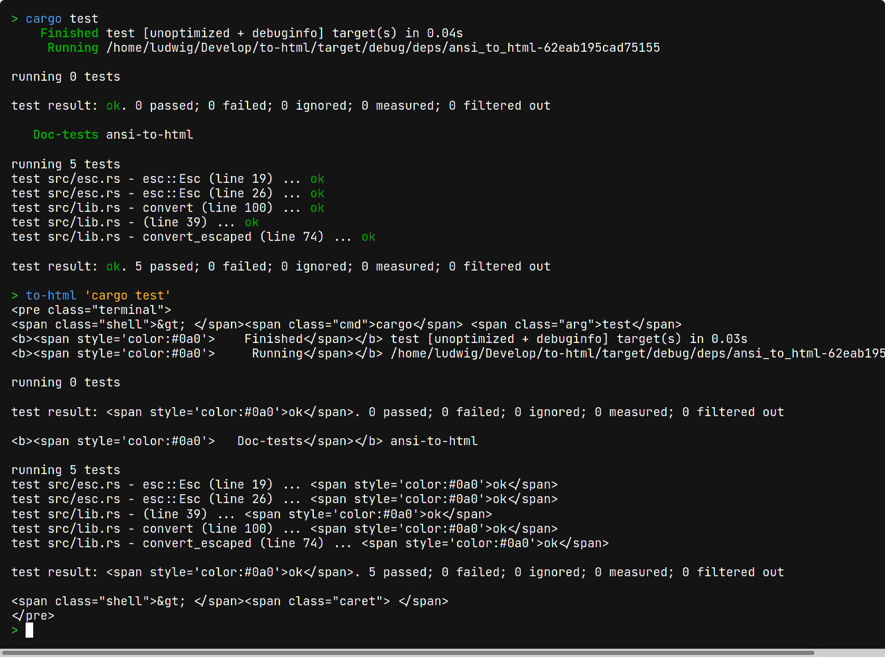

# to-html

Terminal wrapper for rendering a terminal on a website by converting ANSI escape sequences to HTML. Depends on [bash](https://www.gnu.org/software/bash/).

[](./LICENSE) [](https://crates.io/crates/to-html) [](https://github.com/Aloso/to-html/actions?query=workflow%3ATest)

## Changelog ☑

The changelog can be found [here](CHANGELOG.md).

## Installation 🚀

How to install colo is explained on the [releases page](https://github.com/Aloso/to-html/releases).

## Examples 📚

Execute a command:

```bash
to-html 'echo "Hello world"'
```

Execute several commands:

```bash
to-html 'echo "Hello "' 'echo world' ls
```

Commands can contain bash syntax, including pipes and redirections:


```bash
to-html "echo Hello world! | grep 'H' > somefile.txt"
```

## Stylesheet 💎

Include this on your website to get syntax highlighting for the prompt:

<details>
<summary>Click to expand stylesheet</summary>

```css
.terminal {
  background-color: #141414;
  overflow: auto;
  color: white;
  line-height: 120%;
}

.terminal .shell {
  color: #32d132;
  user-select: none;
  pointer-events: none;
}
.terminal .cmd {
  color: #419df3;
}
.terminal .hl {
  color: #00ffff;
  font-weight: bold;
}
.terminal .arg {
  color: white;
}
.terminal .str {
  color: #ffba24;
}
.terminal .pipe, .terminal .punct {
  color: #a2be00;
}
.terminal .flag {
  color: #ff7167;
}
.terminal .esc {
  color: #d558f5;
  font-weight: bold;
}
.terminal .caret {
  background-color: white;
  user-select: none;
}
```

</details>

## Demonstration 📸

```bash
> to-html 'cargo test' "to-html 'cargo test'"
```



## Code of Conduct 🤝

Since this program is written in Rust, the [Rust code of conduct](https://www.rust-lang.org/policies/code-of-conduct) applies. Please be friendly and treat everyone with respect.

## Contributing 🙌

I appreciate your help! The easiest way to help is to file bug reports or suggest new features in the [issue tracker](https://github.com/Aloso/to-html/issues).

If you want to create a pull request, make sure the following requirements are met:

* The code is documented
* If you add a dependency that includes unsafe code, please explain why it is required
* Please try to keep compile times small, if feasible

Also, to pass continuous integration, the code must

* be properly formatted with cargo fmt
* pass cargo clippy
* compile on the latest stable Rust version on Ubuntu, Windows and macOS.
* all tests must pass

To contribute to the website, send a PR to the gh-pages branch.

That's it! If you have any questions, feel free to create an issue.
